# Music Recommender Simulation

## Project Summary

This project is a CLI-first music recommender simulation that uses a content-based approach to rank songs for a user. The system compares each song in a small catalog against a user taste profile built from genre, mood, target energy, target tempo, target valence, target danceability, and acoustic preference. It then assigns a weighted score to every song, ranks the catalog from highest to lowest match, and returns the top recommendations with short explanations for why each song was selected.

---

## How The System Works

Real-world recommendation systems usually combine many signals at once. Platforms like Spotify or YouTube learn from large amounts of behavior data such as plays, skips, likes, watch time, repeated listening, and what similar users enjoyed next. They often retrieve a large set of possible candidates, score each item with machine learning models, and then rank the list while balancing relevance, novelty, and variety. In other words, real systems do not just ask whether a song is "good"; they ask whether it is a good fit for a particular person at a particular moment.

This project uses a simpler and more transparent content-based recommender. Instead of learning from the behavior of many users, it recommends songs by comparing the attributes of each song to one user's stated preferences. Each `Song` includes features such as `genre`, `mood`, `energy`, `tempo_bpm`, `valence`, `danceability`, and `acousticness`. The `UserProfile` was expanded beyond genre, mood, and energy to also include `target_tempo_bpm`, `target_valence`, and `target_danceability`. I added these values because genre and mood alone are too coarse: they can separate something like chill lofi from intense rock, but they do not capture finer differences such as cheerful versus melancholy songs, fast versus steady songs, or groove-heavy versus more atmospheric songs.

The workflow is: input a user's taste profile, loop through every song in `songs.csv`, score each song against the profile, sort all songs by score, and return the top `k` results. The scoring rule rewards songs that are closer to the user's preferred values, not just songs with higher numbers. Exact matches on categorical features like genre and mood add bonus points, while numerical features are scored by closeness to the user's target. For example, a song with energy near the user's target energy should score higher than one that is much lower or much higher. This means the system prioritizes interpretable matches: similar vibe first, then the closest overall fit across the remaining features.

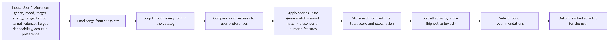

The current weighting strategy is designed so that numeric vibe features lead and categorical labels refine the result. A reasonable starting point is `energy = 3.0`, `tempo_bpm = 2.5`, `danceability = 2.0`, `genre = 2.0`, `mood = 2.0`, `valence = 1.5`, and `acousticness = 1.5`. `Energy` and `tempo_bpm` are weighted the most because they strongly separate low-key tracks from intense ones in this dataset. `Danceability` also matters because it helps identify whether a song feels groove-driven or more reflective. `Genre` and `mood` still matter, but they are not given overwhelming weight because the dataset has many one-off labels, and exact matches would otherwise dominate too much. `Valence` and `acousticness` are useful secondary signals that help describe emotional tone and sonic texture.

This system also has clear biases. Because `energy` and `tempo_bpm` have the largest weights, the recommender may over-prioritize the overall intensity of a song and underrate songs that match the user's genre or emotional taste in a subtler way. Exact genre and mood matching can also be brittle because many labels appear only once, which may make the system treat similar songs as different just because they use different tags. The model does not understand lyrics, cultural context, language, or changing mood over time, and it assumes that a user's taste can be summarized by a small fixed profile. That makes the system easy to explain, but less flexible and potentially less fair than a richer real-world recommender.

---

## Getting Started

### Setup

1. Create a virtual environment (optional but recommended):

   ```bash
   python -m venv .venv
   source .venv/bin/activate      # Mac or Linux
   .venv\Scripts\activate         # Windows
   ```

2. Install dependencies

   ```bash
   pip install -r requirements.txt
   ```

3. Run the app:

   ```bash
   python -m src.main
   ```

### Running Tests

Run the starter tests with:

```bash
pytest
```

You can add more tests in `tests/test_recommender.py`.

---

## Example Results

These screenshots show sample terminal output from the recommender after scoring songs, sorting them by total score, and returning the top matches.

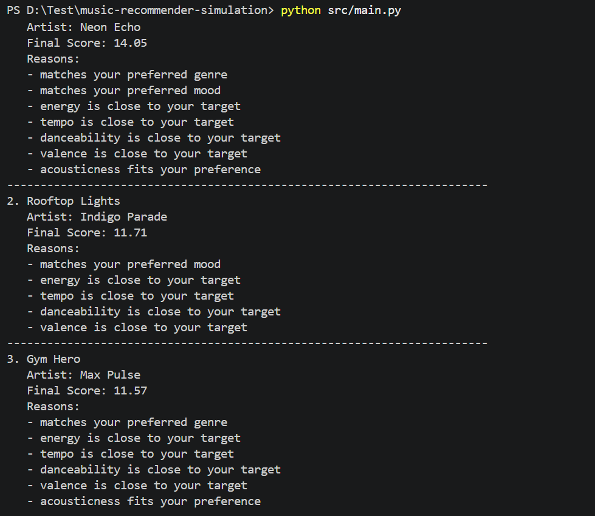

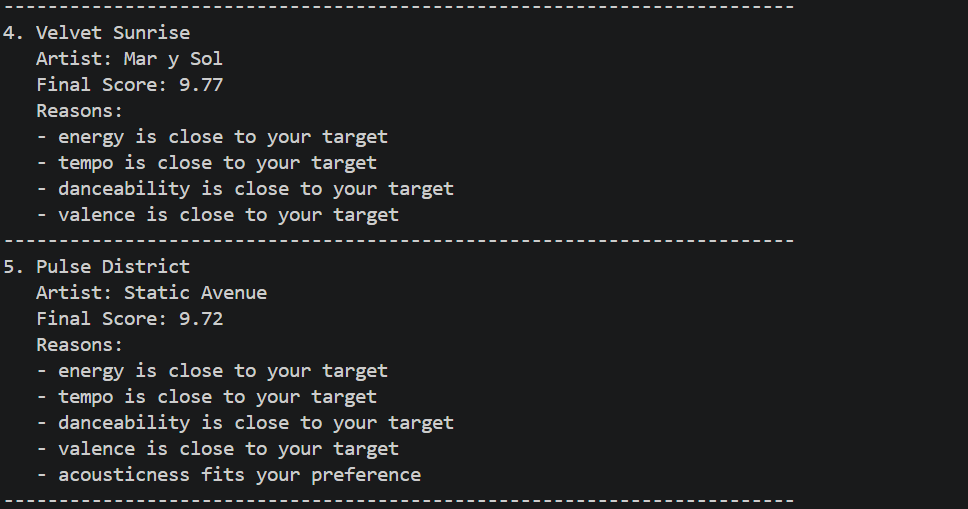

### Edge-Case Results

`result3.png` and `result4.png` test a contradictory user profile: a user whose categorical and numeric preferences pull in opposite directions. The user asks for `lofi` and `chill`, but also wants extremely high energy, very fast tempo, high valence, and high danceability. This checks whether the system stays loyal to genre and mood labels or gets pulled toward intense numeric matches instead.

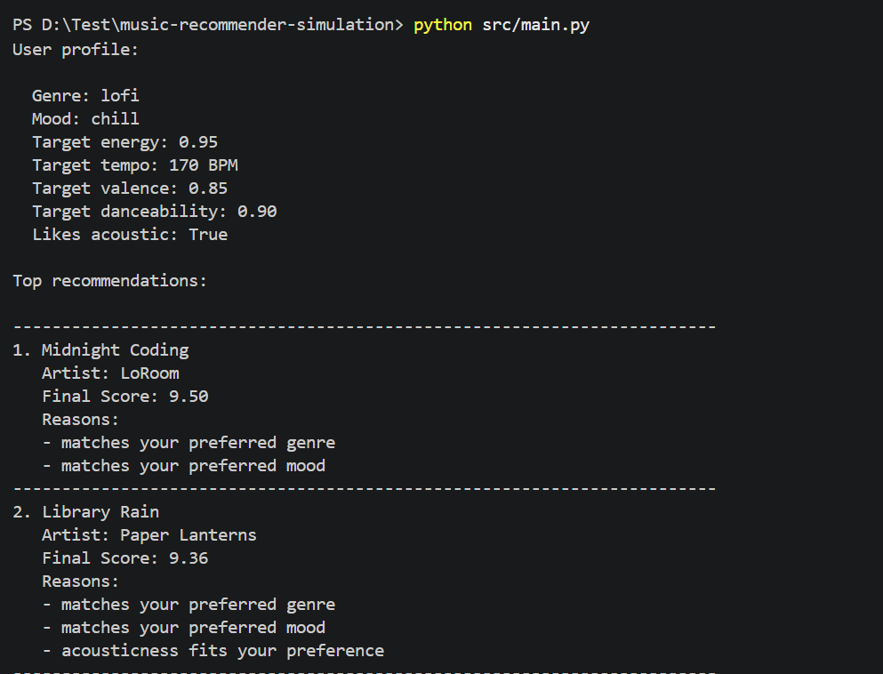

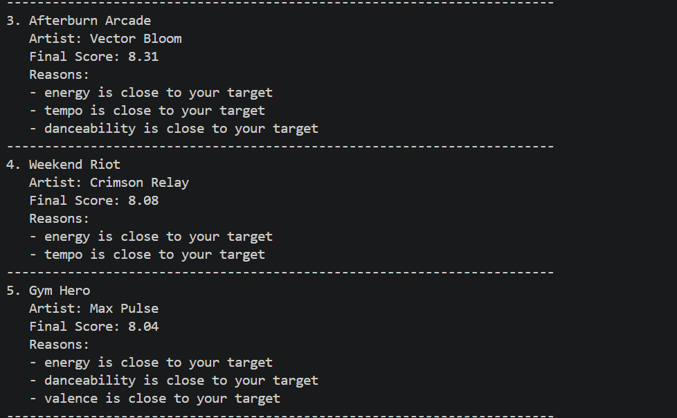

`result5.png` and `result6.png` test a sparse-match profile: a user whose labels point in conflicting directions and have very few natural matches in the catalog. The user asks for `classical` and `aggressive` at the same time, with very low energy and very low danceability. This helps show whether the recommender still returns sensible results when no song is a clean match across all dimensions.

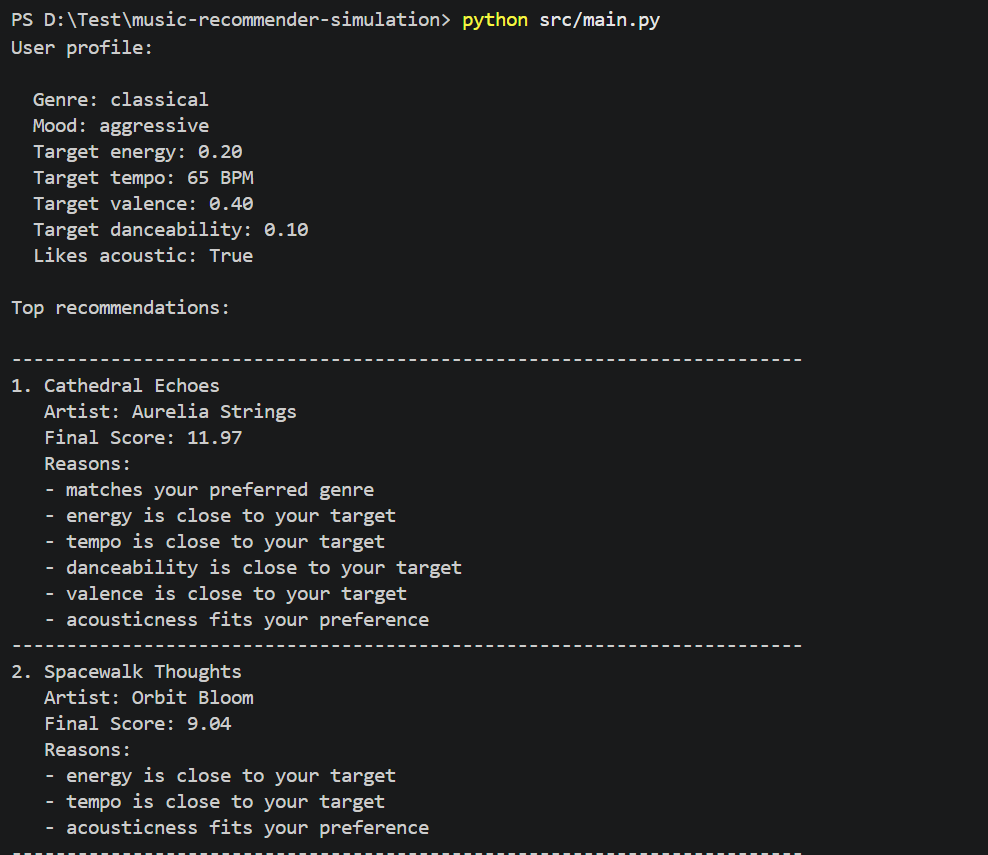

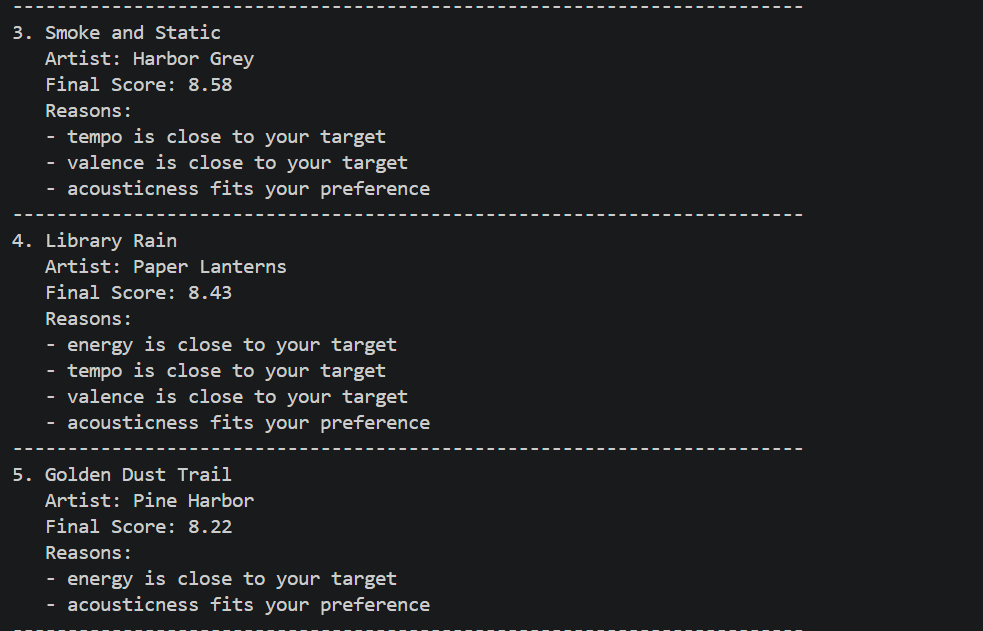

`result7.png` and `result8.png` test a mood trap profile: a user whose mood label conflicts with the rest of the profile. The user asks for `edm` but `chill`, while also preferring very high energy, fast tempo, high danceability, and low acousticness. This checks whether a single mood label can overpower the stronger numeric vibe signals.

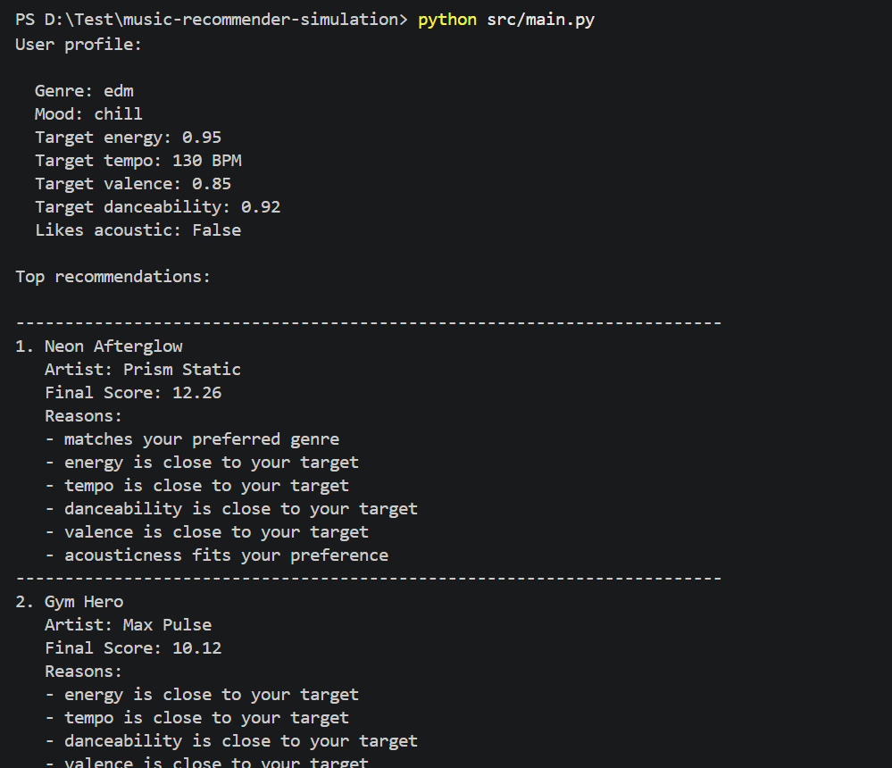

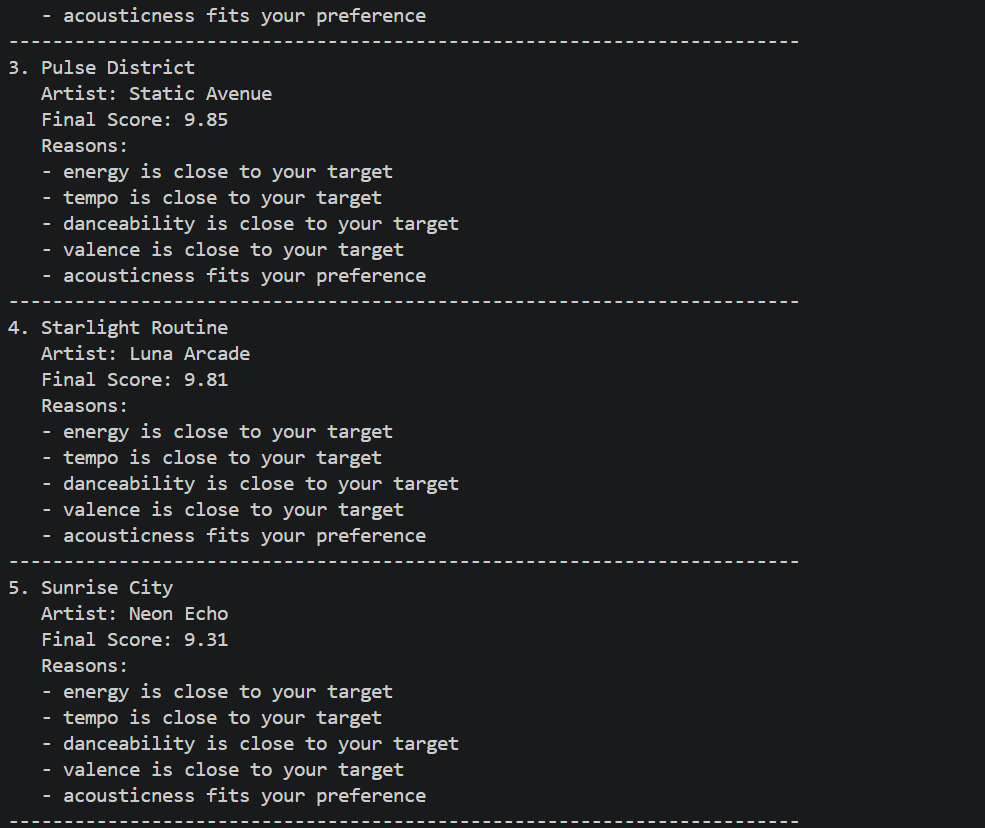

`result9.png` and `result10.png` test an acoustic conflict profile: a user who wants highly acoustic songs but also wants club-like numeric features. The user asks for `folk`, `playful`, high energy, fast tempo, high danceability, high valence, and `likes_acoustic = True`. This reveals whether acoustic preference is strong enough to compete with a profile that otherwise points toward bright pop and dance tracks.

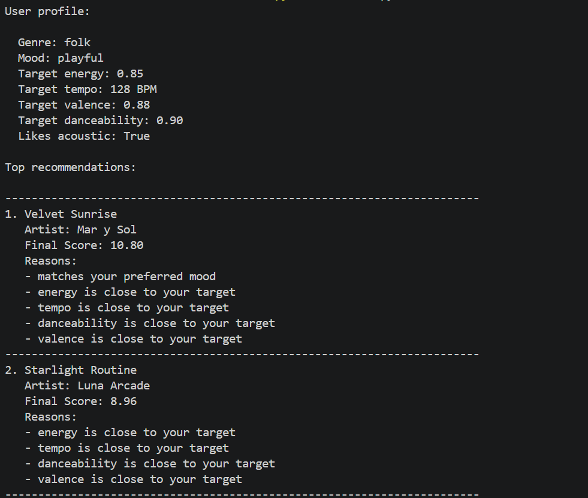

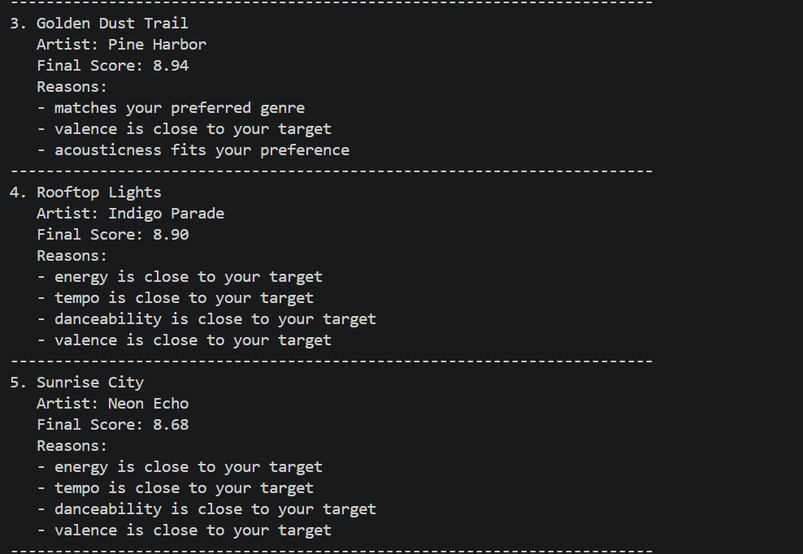

---

## Experiments You Tried

One useful experiment was shifting the weights so that `energy` mattered much more and `genre` mattered much less. I changed `energy` from `3.0` to `6.0` and `genre` from `2.0` to `1.0`, then reran the recommender using the sample profile in `main.py` (`pop`, `happy`, `energy = 0.8`, `tempo_bpm = 120`, `valence = 0.8`, `danceability = 0.8`, `likes_acoustic = False`).

With the original weights, the top 5 songs were `Sunrise City`, `Rooftop Lights`, `Gym Hero`, `Velvet Sunrise`, and `Pulse District`. After the weight shift, the top 5 became `Sunrise City`, `Rooftop Lights`, `Gym Hero`, `Velvet Sunrise`, and `Midtown Strut`. The top 3 stayed the same, but the lower part of the ranking moved toward songs that were closer in pure energy and dance feel, even without a genre match. This suggests that doubling `energy` makes the system more intensity-driven and reduces the influence of style labels, which can help find vibe-based matches but can also make the recommender less genre-aware.

---

## Limitations and Risks

One weakness I discovered during my experiments is that the recommender can become too sensitive to whichever numeric feature has the highest weight, especially `energy`. When I doubled the importance of `energy` and cut the importance of `genre` in half, the lower-ranked results shifted away from genre-consistent songs and toward songs that were simply closer in intensity and dance feel. This means the system can recommend songs that are mathematically close on one dimension but less intuitive stylistically.

The recommender also works on a very small catalog and only uses a limited set of structured features. It does not understand lyrics, language, cultural context, or why a user likes a song. Because many genres and moods appear only once in the dataset, exact label matching can also be brittle and may treat similar songs as more different than they really are.

---

## Reflection

Building this project helped me understand that recommenders turn data into predictions by translating both users and items into comparable features, then applying a scoring rule that rewards strong matches. In this project, that meant comparing each song's genre, mood, and audio-style features against a user profile and converting those matches into a final score. Even though the logic is simple, it still shows the basic idea behind larger systems: recommendation is really a series of small comparisons, weighted decisions, and ranking steps.

I also learned that bias and unfairness can appear very quickly, even in a small simulation. The model only knows the features I gave it, so it can overvalue some aspects of taste and ignore others completely. For example, when I increased the weight on energy, the system started favoring intensity over genre fit, which made some recommendations feel less intuitive. That showed me how design choices like weights, labels, and available data can shape what users see, and how a recommender can seem objective while still reflecting the assumptions built into it.
